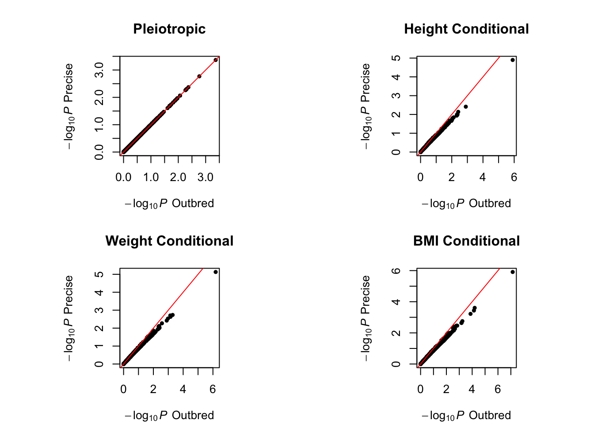
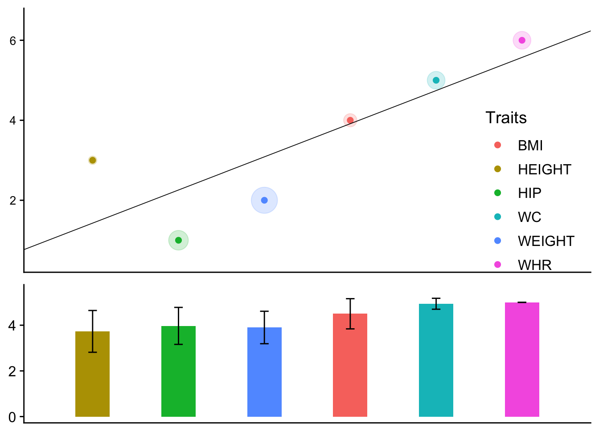

# MultiABEL
Multi-Trait Genome-Wide Association Analysis

## Installation
Run the following command in R to install the MultiABEL package from CRAN (stable but not latest!):
``` r
install.packages("MultiABEL")
```

To install the developer version from R-Forge:
``` r
install.packages("MultiABEL", repos="http://R-Forge.R-project.org")
```

To install the developer version from GitHub:
``` r
require(devtools)
install_github("xiashen/MultiABEL")
```

As only CRAN compiles for macOS platform, so for the developer versions, both Linux and Mac users need to have gfortran compiler set up.

MultiABEL can be loaded in R via:
``` r
library(MultiABEL)
```
or 
``` r
require(MultiABEL)
```
 

## Multi-Trait GWAS using Summary Association Statistics

### Example Summary Statistics

MultiABEL allows convenient and fast GWAS of multiple phenotypes directly from summary association statistics, i.e. genome-wide (or sufficiently large subset of) association results containing estimated genetic effects, standard errors, and reference alleles information. Here, we directly provide an example, and the data can be obtained from: <https://www.dropbox.com/sh/2xftha9wcanobo4/AAD6ygCMyUv_gpDtIwRtw-Mta?dl=0>

Each file of single-trait GWAS summary statistics should contain columns for variant names (default column name `snp`), the first (coding or reference) alleles (default column name `a1`), allele frequencies (default column name `freq`), effect sizes (default column name `beta`), standard errors (default column name `se`), and sample sizes (default column name `n`). For example, here the top of the summary statistics file for height looks like:

``` r
height <- read.table('height.txt', header = TRUE)
head(height)
```

    ##          snp a1 a2   freq    beta     se     p       n
    ## 1  rs4747841  a  g 0.5500  0.0025 0.0061 0.680 60558.2
    ## 2  rs4749917  t  c 0.4500 -0.0025 0.0061 0.680 60558.1
    ## 3   rs737656  a  g 0.3667 -0.0073 0.0064 0.250 60529.2
    ## 4   rs737657  a  g 0.3583 -0.0075 0.0064 0.240 60527.3
    ## 5 rs17524355  t  c     NA -0.0460 0.0460 0.320  1700.0
    ## 6  rs7086391  t  c 0.2000 -0.0130 0.0079 0.099 59675.0

where the columns `p` and `a2` are extra information. For default simple pleiotropic analysis (`MultiSummary(..., type = 'direct')`, see below), `n` is not essentially required, if unknown, simply give a large number, e.g. 10,000. For `MultiSummary(..., type = 'precise')`, `freq` can be any values between 0 and 1, as the exact genotypic variances are given.

**MultiABEL** does NOT require different single-trait GWAS having been performed in exactly the same individuals.

### Loading multiple GWAS summary statistics

Prior to loading the summary association statistics, you need names of a set of independent SNPs. These SNPs will be used for estimating the phenotypic correlation between phenotypes, accounting for partial sample overlap. The number of such SNPs are not important, as long as it's large enough, e.g. thousands. However, LD-pruning might be important. We provide a set of LD-pruned SNPs that can be used for any set of European-ancestry GWAS, can be loaded as:
``` r
load('indep.snps.RData')
```
Thereafter, the summary statistics data can be loaded as:
``` r
data <- load.summary(c('height.txt', 'weight.txt', 'bmi.txt'), indep.snps = indep.snps)
```

	## loading data ...
	## Progress: 100%
	## checking markers ...
	## Progress: 100%
	## cleaning data ...
	## Progress: 100%
	## correcting parameters ...
	## Progress: 100%
	## adjusting sample size ... done.
	## finalizing summary statistics ...
	## Progress: 100%
	## samples partially overlap!
	## estimating shrinkage phenotypic correlations ... done.

The first command reads a set of independent SNPs for correlation estimation. If you have your own set of independent markers to import, simply replace. The loaded data contains three sub-objects: `$gwa`, `$cor.pheno` and `$var.pheno`, where `$gwa` is a cleaned data frame of single-trait GWAS results, and the rest are shrinkage phenotypic correlation matrix and phenotypic variances, both estimated or given by user input.

``` r
head(data$gwa)
```

    ##           height.txt.beta height.txt.se weight.txt.beta weight.txt.se
    ## rs4747841          0.0025        0.0061          0.0003        0.0064
    ## rs4749917         -0.0025        0.0061         -0.0003        0.0064
    ## rs737656          -0.0073        0.0064         -0.0063        0.0066
    ## rs737657          -0.0075        0.0064         -0.0056        0.0066
    ## rs7086391         -0.0130        0.0079          0.0094        0.0083
    ## rs878177           0.0140        0.0066          0.0008        0.0069
    ##           bmi.txt.beta bmi.txt.se      f       n
    ## rs4747841       0.0005     0.0063 0.5500 58322.7
    ## rs4749917      -0.0005     0.0063 0.4500 58322.6
    ## rs737656       -0.0025     0.0066 0.3667 58322.7
    ## rs737657       -0.0020     0.0066 0.3583 58316.8
    ## rs7086391       0.0230     0.0082 0.2000 58322.5
    ## rs878177       -0.0100     0.0068 0.3000 58322.4

``` r
data$cor.pheno
```

    ##             height.txt weight.txt     bmi.txt
    ## height.txt  1.00000000 0.31558706 -0.16242127
    ## weight.txt  0.31558706 1.00000000  0.85458914
    ## bmi.txt    -0.16242127 0.85458914  1.00000000

``` r
data$var.pheno
```

    ## [1] 1 1 1

Default `load.summary(..., est.var = FALSE)` assumes all phenotypic variances are 1, which is a known value for GWAS with inverse-Gaussian transformation of the phenotypes. Setting `est.var = TRUE` will estimate the phenotypic variances using summary statistics, which is useful e.g. for case-control studies where the variance of liability can be estimated.

### A Simple Pleiotropic Meta-Analysis

Once the data are successfully loaded, the simplest multi-trait pleiotropic analysis is straightforward:

``` r
result <- MultiSummary(data)
```

    ## Multi-trait genome scan ... Done.

The result is a list with two sub-objects `$scan` and `$coef`. For this simple analysis, only the data frame `$scan` is reported, where the column `p` gives the multi-trait analysis p-values.

``` r
head(result$scan)
```

    ##              marker   freq       n             p
    ## rs4747841 rs4747841 0.5500 58322.7 0.79726537769
    ## rs4749917 rs4749917 0.4500 58322.6 0.79726537771
    ## rs737656   rs737656 0.3667 58322.7 0.63421006065
    ## rs737657   rs737657 0.3583 58316.8 0.65262659863
    ## rs7086391 rs7086391 0.2000 58322.5 0.00042921138
    ## rs878177   rs878177 0.3000 58322.4 0.01821862433

The result is analog to the MANOVA analysis in R, such as `manova(cbind(Trait1, Trait2, Trait3) ~ SNP)`.

### Pleiotropic & Conditional Meta-Analysis in HWE Outbred Population

If we assume that our outbred populations for the three phenotypes follow Hardy-Weinberg equilibrium (HWE), we can then perform deeper pleiotropic meta-analysis, with more estimates including conditional genetic effects. For example:

``` r
result.out <- MultiSummary(data, type = 'outbred')
```

    ## Multi-trait genome scan ... Done.

The result is a list with two sub-objects `$scan` and `$coef`. Now, the data frame `$scan` is reported with more columns, corresponding to three *conditional* GWAS analyses, i.e. single-trait GWAS for each trait with the other traits included as covariates:

``` r
head(result.out$scan)
```

    ##              marker   freq       n             p    beta.score
    ## rs4747841 rs4747841 0.5500 58322.7 0.79726537769 1.8754020e-05
    ## rs4749917 rs4749917 0.4500 58322.6 0.79726537771 1.8754020e-05
    ## rs737656   rs737656 0.3667 58322.7 0.63421006065 3.3824150e-05
    ## rs737657   rs737657 0.3583 58316.8 0.65262659863 3.1213268e-05
    ## rs7086391 rs7086391 0.2000 58322.5 0.00042921138 3.9293148e-04
    ## rs878177   rs878177 0.3000 58322.4 0.01821862433 2.0098628e-04
    ##                se.score beta.cond.height.txt se.cond.height.txt
    ## rs4747841 7.3004707e-05        0.00279569491       0.0026842035
    ## rs4749917 7.3004707e-05       -0.00279569491       0.0026842058
    ## rs737656  7.1087581e-05       -0.00069077805       0.0027711098
    ## rs737657  6.9344900e-05       -0.00126907245       0.0027851258
    ## rs7086391 1.1158264e-04        0.00801804470       0.0033387984
    ## rs878177  8.5122393e-05       -0.00337208905       0.0029142862
    ##           p.cond.height.txt beta.cond.weight.txt se.cond.weight.txt
    ## rs4747841       0.297626798       -0.00133195655       0.0014126825
    ## rs4749917       0.297627212        0.00133195655       0.0014126838
    ## rs737656        0.803145371       -0.00056711104       0.0014584137
    ## rs737657        0.648633972       -0.00023895596       0.0014657971
    ## rs7086391       0.016329074       -0.00593304553       0.0017570168
    ## rs878177        0.247235918        0.00357046716       0.0015336614
    ##           p.cond.weight.txt beta.cond.bmi.txt se.cond.bmi.txt
    ## rs4747841     0.34575444223     1.3979808e-03    0.0014689944
    ## rs4749917     0.34575485575    -1.3979808e-03    0.0014689957
    ## rs737656      0.69738363269     3.3470484e-04    0.0015165516
    ## rs737657      0.87050176200     3.4480639e-05    0.0015242273
    ## rs7086391     0.00073341764     7.3051451e-03    0.0018269113
    ## rs878177      0.01990852313    -4.0863748e-03    0.0015947648
    ##           p.cond.bmi.txt
    ## rs4747841  3.4127027e-01
    ## rs4749917  3.4127068e-01
    ## rs737656   8.2532506e-01
    ## rs737657   9.8195202e-01
    ## rs7086391  6.3709785e-05
    ## rs878177   1.0396101e-02

The `p` column is analog to the MANOVA analysis in R, such as `manova(cbind(Trait1, Trait2, Trait3) ~ SNP)`. The remaining three columns per trait are analog to the regression analysis in R, such as `lm(Trait1 ~ Trait2 + Trait3 + SNP)`.

The `$coef` data frame in the result gives an alternative conditional analysis, i.e. the multiple regression of the SNP dosage on the phenotypes, analog to R analysis `lm(SNP ~ Trait1 + Trait2 + Trait3)`.

### Pleiotropic & Conditional Meta-Analysis in Inbred Population

In inbred populations, we have the allele frequencies being equal to the corresponding genotype frequencies. Therefore, different from a HWE outbred population where *genotype ~ Binomial(2,freq)*, we have *genotype ~ Bernoulli(freq)*. This does not change the pleiotropic analysis p-values, but will have an effect on the conditional analysis. The analysis using **MultiABEL** is very similar to above: `MultiSummary(data, type = 'inbred')`.

### Pleiotropic & Conditional Meta-Analysis with Precise Genotypic Variances

Regardless of HWE or the genotype frequencies, if the genotypic variance per variant is precisely calculated, one can perform the above analysis in a generic way. As an example, let us assume our summary statistics were indeed obtained in a HWE population, but somehow our minor allele frequencies (MAF) were over-estimated by 25%. We can then calculate the correct genotypic variances:

``` r
f <- data$gwa[,'f']
minor <- data$gwa[,'f'] <= 0.5
f[minor] <- data$gwa[minor,'f']*.8
f[!minor] <- 1 - (1 - data$gwa[!minor,'f'])*.8
gv <- 2*f*(1 - f)
```

Then, the correct pleiotropic and conditional meta analysis can be performed by:

``` r
result.pre <- MultiSummary(data, type = 'precise', vars = gv)
```

    ## Multi-trait genome scan ... Done.

We can see that the joint analysis is not affected by allele frequencies being incorrectly reported, but the conditional analysis is. Over-estimating MAF inflates the conditional analysis signals.




### Multi-Traits Correlation Replication

Aiming to replicate the locus pleiotropic profile in the replication sample, we develop this Monte-Carlo based correlation replication strategy.

#### What Data Are Required?

-   GWAS summary statistics for sample 1, includes effect alleles (column name `A1`), reference alleles (column name `A2`) and two columns for each trait: effect sizes (column name `Trait.beta`) and standard errors (column name `Trait.se`).

-   GWAS summary statistics for sample 2, includes effect alleles (column name `A1`), reference alleles (column name `A2`) and two columns for each trait: effect sizes (column name `Trait.beta`) and standard errors (column name `Trait.se`).

-   Phenotypic correlation matrix for the traits in sample 1.

-   Phenotypic correlation matrix for the traits in sample 2.

For summary-level data, all the data above are available in the outputs of **load.summary** function. For individual-level data, the GWAS summary statistics and phenotypic correlation matrix can be computed directly.

Let us load the example data by:

``` r
data(example.MV.cor.test)
```

#### An Example of Multi-Traits Correlation Replication

After specifying the traits we are interested in, we can perform the multi-traits correlation replication for a SNP as below:

``` r
traits <- c("HEIGHT", "BMI", "HIP", "WC", "WHR", "WEIGHT")
set.seed(510)
MV.cor.test(marker = "rs905938", gwa.1 = example.gwa.1, gwa.2 = example.gwa.2, R.1 = example.R.1,
            R.2 = example.R.2, traits = traits)
```

    ## correlation     ci.left    ci.right 
    ##      0.8281      0.4667      1.0000

The function computes Kendall rank correlation coefficient by default. Users can choose to compute Pearson's or Spearman's correlation. For example, Pearson's correlation can be computed by:

``` r
MV.cor.test(marker = "rs905938", gwa.1 = example.gwa.1, gwa.2 = example.gwa.2, R.1 = example.R.1,
            R.2 = example.R.2, method = "pearson", traits = traits)
```

    ## correlation     ci.left    ci.right 
    ##      0.9825      0.8447      0.9922

The `ci.left` and `ci.right` reported above are 2.5% and 97.5% quantiles of the estimated distribution of the correlation coefficient, respectively. The estimated distribution is based on 10,000 times Monte-Carlo simulations by default. Users can customize these arguments by varying `probs` and `nrep` as below:

``` r
MV.cor.test(marker = "rs905938", gwa.1 = example.gwa.1, gwa.2 = example.gwa.2, R.1 = example.R.1, probs = c(0.1, 0.9), nrep = 1000, R.2 = example.R.2, traits = traits)
```

    ## correlation     ci.left    ci.right 
    ##      0.8281      0.6000      0.8667

Now the reported `ci.left` and `ci.right` are 10% and 90% quantiles based on 1,000 times Monte-Carlo simulations.

#### Visualizing the Results of Multi-Traits Correlation Replication

To visualize the results of multi-traits correlation replication, we can make a plot by:

``` r
require(ggplot2)
require(cowplot)
set.seed(510)
res.mv.cor <- MV.cor.test(marker = "rs905938", gwa.1 = example.gwa.1, gwa.2 = example.gwa.2, R.1 = example.R.1,
                          R.2 = example.R.2, traits = traits, plot = TRUE)
df.plot <- res.mv.cor$df.plot

p1 <- ggplot()+ 
  geom_point(data=df.plot, mapping=aes(x=rank.1, y=rank.2, color=traits), size=2) + 
  geom_point(data=df.plot, mapping=aes(x=rank.1, y=rank.2, color=traits, size = se.beta), alpha = 0.2) + 
  stat_smooth(data=df.plot, mapping=aes(x=rank.1, y=rank.2), method = "lm", se=FALSE, color="black", size=0.3, fullrange = TRUE) + 
  coord_cartesian(xlim = c(0.5, 6.5), ylim = c(0.5, 6.5)) + xlim(0,200) + 
  scale_size_continuous(range = c(3, 10)) +
  theme(axis.text=element_text(size=10),
        axis.title=element_text(size=14,face="bold"), 
        strip.text.x = element_text(size = 16))+ 
  theme(axis.title.x=element_blank(),axis.text.x=element_blank(),
        axis.ticks.x=element_blank(),axis.title.y=element_blank(), legend.position = c(0.8,0.3), 
        legend.background=element_rect(colour='NA', fill='transparent'), legend.key=element_blank(), 
        legend.title=element_text(size=14), 
        legend.text=element_text(size=12), legend.key.size = unit(1.4, 'lines')) + 
  guides(colour = guide_legend(override.aes = list(alpha = 1)), size = FALSE) +
  scale_colour_discrete(name = "Traits")

p2 <- ggplot(data=df.plot, aes(x=rank.1,y=mean.conc)) +
  coord_cartesian(xlim = c(0.5, 6.5), ylim = c(0, 5.5)) + 
  geom_bar(stat = "identity", aes(fill=traits), width = 0.4) + theme(legend.position="none") + theme(
    strip.background = element_blank(),
    strip.text.x = element_blank()
  ) + geom_errorbar(aes(ymin = mean.conc - sd.conc,ymax = mean.conc + sd.conc), width = 0.1)  + 
  theme(axis.title.x=element_blank(),axis.text.x=element_blank(),
        axis.ticks.x=element_blank(),axis.title.y=element_blank()) + 
  theme(plot.margin = unit(c(0, 0, 0, 0), "cm"))

plot_grid(p1,p2,ncol=1,align = "v", rel_heights = c(2,1))
```



Each color represents one trait. There are two parts in this plot. In both parts, the x axis is the ranks of estimated marginal effect sizes in ascending order from sample 1. For the upper part, the y axis is the ranks from sample 2. Therefore each dot represents the rank in sample 1 and sample 2 for one trait. The radius of shade around a dot is proportional to the standard error of the estimated marginal effect. The standard errors are computed with variances in sample 1 and sample 2 using inverse variance weights. To facilitate visualization, a regression line is added. Its slope equals to the Spearman's correlation. In the lower part, the y axis is the mean number of concordant pairs generated by a trait. If a trait has a very low bar, it means the trait disturbs the consistency of the whole rank pattern. The whiskers represents ± 1 times the standard deviation about the mean.

### Conditional Multi-Trait Analysis using Summary Statistics

To detect additional associated SNPs at loci discovered in multi-trait analysis, we can perform conditional analysis in multi-trait analysis framework. We use the following example to illustrate how to perform such analysis based on single-trait GWAS summary statistics.

#### What Data Are Required?

-   GWAS summary statistics for multiple traits at a locus, includes effect alleles (column name `A1`), reference alleles (column name `A2`) and three columns for each trait: effect sizes (column name `Trait.beta`), standard errors (column name `Trait.se`) and sample sizes (column name `N`).

-   Phenotypic correlation matrix for the traits.

The two datasets above are available in the outputs of load.summary function.

-   A reference LD correlation matrix including SNPs at the locus and their corresponding reference alleles. In this manual, we provide commands to compute LD matrix and get reference allele information based on 1000 Genomes European-ancestry samples.

Let us load the example data by:

``` r
data(example.MultiSecondary)
```

#### How to compute the reference LD correlation matrix

As an example, we can use the following commands to get the LD matrix and reference allele information for the SNPs in example.gwas dataset. **Note: [plink 1.9](https://www.cog-genomics.org/plink2) is needed for the following commands.**

Firstly, we can download and unzip genotypes of 1000 Genomes European-ancestry samples (provided by LDSC project) by:

``` r
download.file("https://data.broadinstitute.org/alkesgroup/LDSCORE/1000G_Phase3_plinkfiles.tgz", 
destfile = paste0(find.package('MultiABEL'), "/1000G_Phase3_plinkfiles.tgz"))
untar(paste0(find.package('MultiABEL'), "/1000G_Phase3_plinkfiles.tgz"),exdir=find.package('MultiABEL'))
```

Then we specify the path to plink (**Note: Please change the path below to your own path to the plink executable file**) by:

``` r
path.plink <- "path/to/plink/executable/file/plink"
```

and the path to 1000 Genomes data by:

``` r
path.1kG <- paste0(find.package('MultiABEL'),"/1000G_EUR_Phase3_plink")
```

Now, because the SNPs are at chromosome 1, we can get the LD matrix and reference allele imformation for the SNPs in this sumamry statistics data frame by:

``` r
snps <- rownames(example.gwas)
write.table(snps, file = paste0(snps[1],"_snp_list.txt"), quote = F, row.names = F, col.names = F)
chr <- 1

system(paste0(path.plink," -bfile ", path.1kG,"/1000G.EUR.QC.",chr," --r square --extract ", snps[1], "_snp_list.txt --out ", snps[1], " --noweb"))
system(paste0(path.plink," -bfile ", path.1kG,"/1000G.EUR.QC.",chr," --freq --extract ", snps[1], "_snp_list.txt --out ", snps[1], " --noweb"))

LD_1kG <- as.matrix(read.table(paste0(snps[1], ".ld")))
maf_1kG <- read.table(paste0(snps[1], ".frq"), header = T)
snp_ref_1kG <- maf_1kG[,"A2"]
names(snp_ref_1kG) <- maf_1kG[,"SNP"]
colnames(LD_1kG) <- rownames(LD_1kG) <- maf_1kG$SNP
```

#### An Example of Conditional Multi-Trait Analysis

After specifying the traits we are interested in, we can perform conditional multi-trait analysis for a locus as below:

``` r
traits <- c("HEIGHT", "BMI", "HIP", "WC", "WHR", "WEIGHT")
MultiSecondary(gwa.region = example.gwas, LD.ref = example.LD, snp.ref = example.snp.ref, R.ref = example.R.ref, p.threshold = 5e-8, tol = 0.9, traits = traits, T2.return = TRUE)
```

    ## $T2.sele
    ## rs12033847 rs12138008 
    ##      55.72      52.07 
    ## 
    ## $p.sele
    ## rs12033847 rs12138008 
    ##  3.310e-10  1.807e-09 
    ## 
    ## $b_joint.sele
    ##              HEIGHT       BMI       HIP        WC      WHR    WEIGHT
    ## rs12033847  0.01935 -0.004438 -0.008557  0.004862 0.006473  0.006879
    ## rs12138008 -0.02020 -0.011421 -0.013988 -0.015390 0.002394 -0.029779
    ## 
    ## $se_b_joint.sele
    ##              HEIGHT      BMI      HIP       WC      WHR   WEIGHT
    ## rs12033847 0.003959 0.004616 0.005495 0.005405 0.005194 0.005930
    ## rs12138008 0.004091 0.005777 0.006879 0.006771 0.006589 0.006326

The result is a list with elements of `T2.sele`: The conditional test statistic of the selected variants. It will be provided if `T2.return = TRUE`; `p.sele`: The conditional p-value of the selected variants; `b_joint.sele`: The conditional effect size of the selected variants; `se_b_joint.sele`: The conditional standard error of the selected variants.

The p-value threshold for significance is specified by argument `p.threshold`. The tolerance for multicollinearity among selected genetic variants is given by argument `tol`. Users may customize these two arguments to suit their needs.


## Multi-Trait GWAS using Individual-level Data

#### Multi-Trait GWAS using genotypes from SNP arrays 
Let us first load the example data in the R package GenABEL:
``` r
data(ge03d2ex.clean)
```
which is an object of class gwaa.data, generated by the GenABEL package. \*ABEL suite of packages are compatible with different formats of SNP array genotyping data, such as Affymetrix, Illumina, MACH, PLINK, and text files. For conversion of these formats into ```gwaa.data``` class in R, refer to ```convert.snp.FORMAT``` series of functions in GenABEL.

Once a ```gwaa.data``` object is ready, multi-trait GWAS using the MultiABEL package has only two steps. The first step is to load the gwaa.data object as a multi.loaded format object. For example, in the example data, if we want to perform multi-trait GWAS for height, weight and BMI, with sex and age included as covariates, we run:
``` r
loaded <- MultiLoad(gwaa.data = ge03d2ex.clean, trait.cols = c(5, 6, 8), covariate.cols = c(2, 3))
```
which calculates required statistics for subsequent multi-trait scan. The variables are indicated by column indices, corresponding to the columns in the phenotypic data stored in the ```gwaa.data``` object:
``` r
head(ge03d2ex.clean@phdata)
```
	##          id sex       age dm2    height     weight diet       bmi
	## id199 id199   1 59.228721   1 163.91234  80.407462    0 29.927679
	## id300 id300   1 42.325527   1 177.24822  80.800665    1 25.718829
	## id403 id403   0 31.225693   1 152.59305 114.842811    1 49.321274
	## id415 id415   0 54.455580   1 172.83431  97.392762    0 32.603692
	## id666 id666   1 61.068030   1 172.79525 104.815830    0 35.104539
	## id689 id689   1 57.455284   1 183.40863  83.480342    0 24.816739

Thereafter, the multi-trait scan results can be produced by:
``` r
result <- Multivariate(loaded)
```
The top of the result data frame looks like:
``` r 
head(result)
```
	##              Marker       Beta.S          SE          P  coef.height  coef.weight      coef.bmi
	## rs1646456 rs1646456 0.0204838238 0.031169284 0.51106532 -0.151990037  0.173668489 -0.1534429989
	## rs4435802 rs4435802 0.0086583260 0.035745822 0.80861029  0.092143206 -0.202380210  0.1762167094
	## rs946364   rs946364 0.0214048834 0.031101669 0.49131238 -0.163415525  0.214047011 -0.2005150314
	## rs299251   rs299251 0.0304247846 0.031102692 0.32797333  0.089547868 -0.253542764  0.2019248957
	## rs2456488 rs2456488 0.0278942115 0.031014170 0.36843849  0.257256624 -0.541874214  0.4251691269
	## rs3712159 rs3712159 0.0099905862 0.034535222 0.77236186  0.025174520 -0.026662859 -0.0059335234

where ```Beta.S``` and ```SE``` are the estimated genetic effect size and s.e. on the phenotype score, constructed using the coefficients in the last few ```coef.TRAIT``` columns. ```P``` gives the multivariate p-values.

#### Multi-Trait GWAS using genotype dosages from imputed data 
As other \*ABEL packages, MultiABEL directly works with imputed data in DatABEL format, which is file vector formatted and allows for fast computation. Popular imputed data formats such as IMPUTE can be easily converted using the DatABEL package, please refer to its documentation for the conversion step if needed.

Let us now convert the example data above in gwaa.data class into DatABEL files and run the same scan. First, write the phenotypic data out as the phenotype file:
``` r
write.table(phdata(ge03d2ex.clean), 'pheno.txt', col.names = TRUE, row.names = TRUE, quote = FALSE, sep = '\t')
```
Convert the genotype data into allelic codings and then into DatABEL data files:
``` r
require(DatABEL)
geno <- as.double(ge03d2ex.clean)
matrix2databel(geno, 'geno')
```
	## uninames$unique.names = TRUE
	## uninames$unique.rownames = TRUE
	## uninames$unique.colnames = TRUE
	## backingfilename = geno2
	## cachesizeMb = 64
	## number of columns (variables) =  3507
	## number of rows (observations) =  116
	## usedRowIndex: 1  2  3  4  5  ...
	## usedColIndex: 1  2  3  4  5  6  7  8  9  10  ...
	## Upper-left 10 columns and  5 rows:
	##       rs1646456 rs4435802 rs946364 rs299251 rs2456488 rs3712159 rs4602970 rs175910 rs1919938 rs1116030
	## id199         1         0        1      NaN         0         0         0        2         0         0
	## id300         0         0        0        0         0         0         0        2         0         0
	## id403         1         0        1        0         1       NaN         1        0         1         0
	## id415         0         1      NaN        0         0         0         0        1         1         1
	## id666         1         0        1        1         1         0         0        0         2         0

We can then load the imputed data again using MultiLoad() procedure, but with slightly different input:
``` r
loaded <- MultiLoad(phenofile = 'pheno.txt',  genofile = 'geno', trait.cols = c(5, 6, 8), covariate.cols = c(2, 3))
```
Thereafter, the multi-trait scan results can be produced the same as above:
``` r
result <- Multivariate(loaded)
```

#### Correcting for population structure via GRAMMAR+ residuals 
We suggest the use of GRAMMAR+ residuals to correct for population stratification, generated by the ```polygenic()``` procedure in the GenABEL package. Unlike using the ordinary residuals from linear mixed models, i.e. the GRAMMAR method (Aulchenko et al. 2007 Genetics), GRAMMAR+ residuals provide another version of phenotype transformation to very well approximate a full mixed model solution (Belonogova et al. 2013 PLoS ONE), allowing multivariate analysis of multiple phenotypes in a structured population computationally more feasible. 

If we want to correct for population structure in the above example (assuming there is anything to correct for), we first need to construct the genomic kinship matrix via:
``` r
gkin <- ibs(ge03d2ex.clean, weight = 'freq')
```
For imputed data analysis, this step can be simply performed on the array data where we have directly genotyped markers. Then we can loop over the three phenotypes that we want to analyze, to get the corresponding GRAMMAR+ residuals:
``` r
plus <- ge03d2ex.clean@phdata
for (i in c(5, 6, 8)) {
	poly <- polygenic(ge03d2ex.clean@phdata[,i], gkin, ge03d2ex.clean)
	plus[,i] <- poly$grresidualY
}
```
Now we can save the residuals as a new phenotype file, and run the above multivariate analysis using our prepared “imputed” genotype data:
``` r
write.table(plus, 'pheno.plus.txt', col.names = TRUE, row.names = TRUE, quote = FALSE, sep = '\t')
loaded <- MultiLoad(phenofile = 'pheno.plus.txt',  genofile = 'geno', trait.cols = c(5, 6, 8), covariate.cols = c(2, 3))
```
Thereafter, the multi-trait scan results can be produced the same as above:
``` r
result.plus <- Multivariate(loaded)
```
The top of the new result looks like:
``` r
head(result.plus)
```

	##              Marker       Beta.S          SE          P  coef.height  coef.weight      coef.bmi
	## rs1646456 rs1646456 0.0204838238 0.031169284 0.51106532 -0.151990037  0.173668489 -0.1534429989
	## rs4435802 rs4435802 0.0086583260 0.035745822 0.80861029  0.092143206 -0.202380210  0.1762167094
	## rs946364   rs946364 0.0214048834 0.031101669 0.49131238 -0.163415525  0.214047011 -0.2005150314
	## rs299251   rs299251 0.0304247846 0.031102692 0.32797333  0.089547868 -0.253542764  0.2019248957
	## rs2456488 rs2456488 0.0278942115 0.031014170 0.36843849  0.257256624 -0.541874214  0.4251691269
	## rs3712159 rs3712159 0.0099905862 0.034535222 0.77236186  0.025174520 -0.026662859 -0.0059335234

There is not a substantial structure in this example data, so we do not expect to see inflated signals being corrected away by linear mixed models.

## For Help 

For direct R documentation of the two functions above, you can simply use question mark in R, e.g.
```
?load.summary
?MultiSummary
```
If you have specific questions, you may email the maintainer of MultiABEL via ```xia dot shen at ed dot ac dot uk```.

## References

To know how to cite this work, use command:
``` r
citation("MultiABEL")
``` 
	## If you use the MultiLoad() or Multivariate() procedures, please cite the 1st reference below. 
	## If you use the load.summary() or MultiSummary() procedures, please cite both references below.
	## If you use the MultiRep() procedure, please cite the 2nd reference below.
	## 
	##   Shen X, Klaric L, Sharapov S, Mangino M, Ning Z, Wu D, Trbojevic-Akmacic I, Pucic-Bakovic M, Rudan I, Polasek O, Hayward C, 
	##   Spector TD, Wilson JF, Lauc G, Aulchenko YS (2017). Multivariate discovery and replication of five novel loci associated with Immunoglobulin G N-glycosylation. 
	##   Nature Communications, 8: 447.
	## 
	##   Ning Z, Tsepilov YA, Sharapov SZ, Wang Z, Grishenko AK, Feng X, Shirali M, Joshi PK, Wilson JF, Pawitan Y, Haley CS, Aulchenko YS, Shen X (2019). 
	##   Nontrivial Replication of Loci Detected by Multi-Trait Methods. 
	##   Frontiers in Genetics, 12: 627989.
	## 
	## To see these entries in BibTeX format, use 'print(<citation>, bibtex=TRUE)', 'toBibtex(.)', or set 'options(citation.bibtex.max=999)'.


